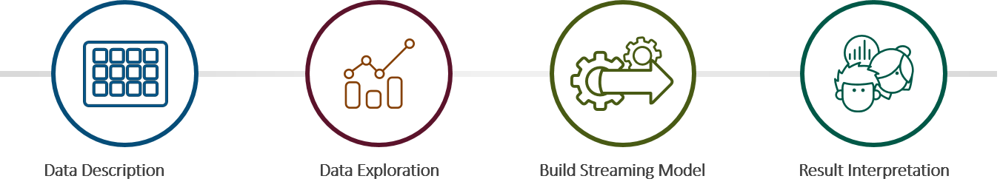
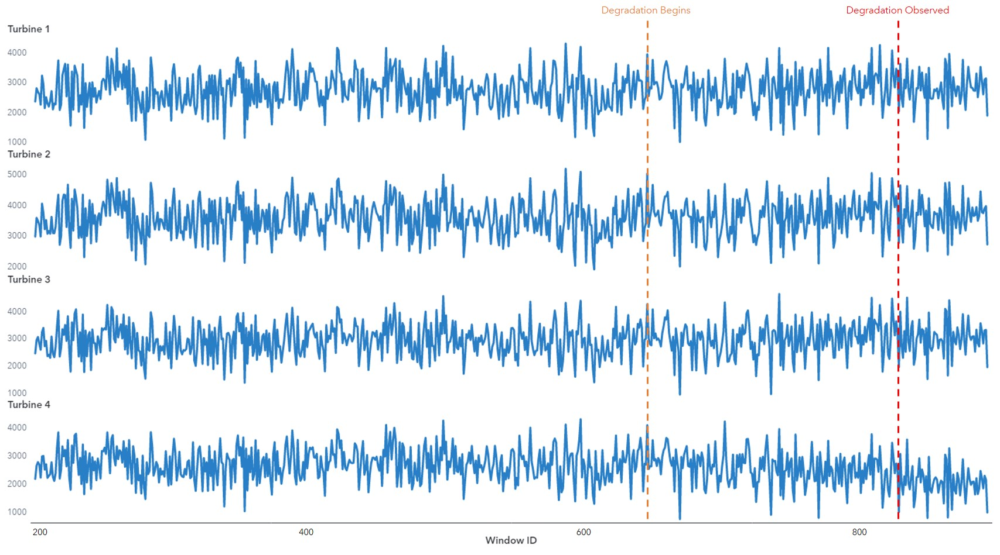
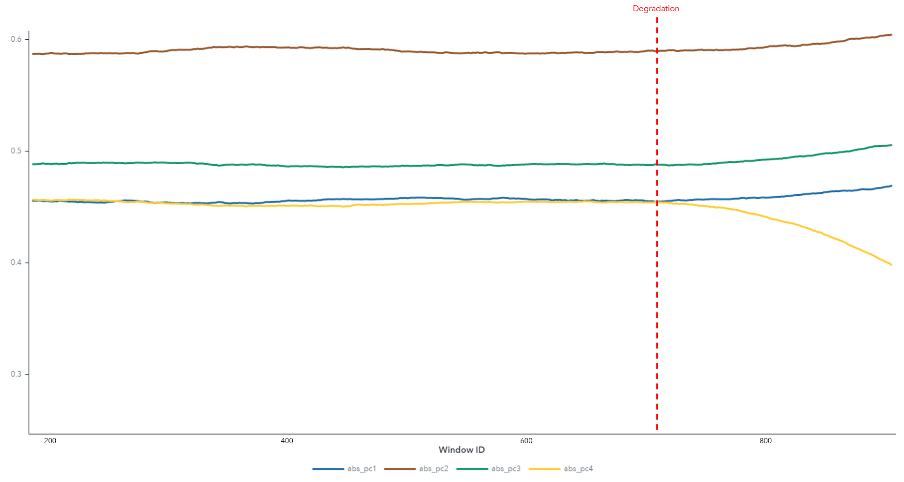
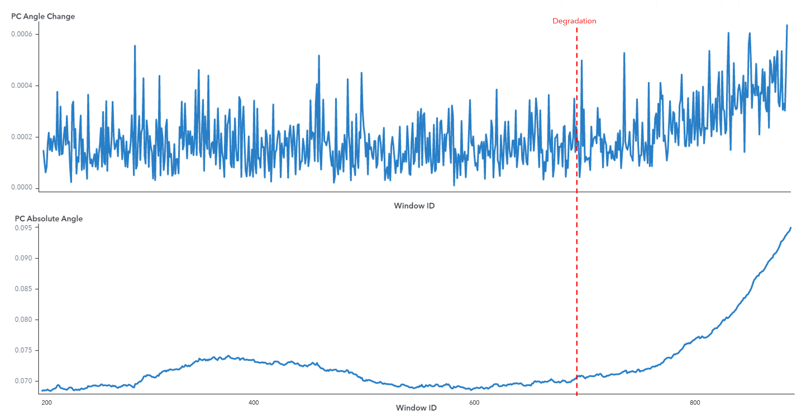

# Detecting Degradation in Wind Turbines

    

## Overview

Learn how to monitor degradation of wind turbines in real-time. In this example, we will use simulated data which is the hourly energy (in kilowatts) produced by each of the four turbines.

Key take-aways from the use case: 
* Learn how to design streaming model for real-time failure detection
* Learn how to use [Subspace tracking](https://gitlab.sas.com/IOT/accelerators/high-frequency-algorithms-for-iot-applications/blob/master/docs/sst.md) algorithm to detect anomalies
* Best practices for [Subspace tracking](https://gitlab.sas.com/IOT/accelerators/high-frequency-algorithms-for-iot-applications/blob/master/docs/sst.md) algorithm

We will use the [Subspace tracking (SST)](https://gitlab.sas.com/IOT/accelerators/high-frequency-algorithms-for-iot-applications/blob/master/docs/sst.md) algorithm packaged in **SAS Event Stream Processing Studio** to detect degradation in real time using streaming data. It is a method to detect anomalies and system degradation in systems that generate high-frequency, high-dimensional data. It can be used for data containing a single measure for sensors from various devices operating under similar conditions (e.g., energy output from multiple panels in a Solar farm), or multiple measures for sensors from a single device operating under similar conditions (e.g., turbofan in an aircraft).

### Prerequisites

List of required software offered as part of [**SAS Analytics for IoT:**](https://www.sas.com/en_us/software/analytics-iot.html) 
*  [SAS Visual Analytics 8.3](https://support.sas.com/en/software/visual-analytics-support.html#documentation)
*  [SAS Event Stream Processing Studio 6.1](https://go.documentation.sas.com/?cdcId=espcdc&cdcVersion=6.1&docsetId=espstudio&docsetTarget=titlepage.htm&locale=en)
*  [SAS Event Stream Processing Streamviewer 6.1](https://go.documentation.sas.com/?cdcId=espcdc&cdcVersion=6.1&docsetId=espvisualize&docsetTarget=titlepage.htm&locale=en)

## Getting Started

This examples takes you through the workflow to build degradation model using tools offered as part of **SAS Analytics for IoT.**

### Data Description 
This [data,](data/turbine.csv) which are simulated, are the hourly energy (in kilowatts) produced by each turbine. 

### Data Exploration
We begin with analyzing the data in SAS Visual Analytics. The plot in figure 1 shows the amount of energy produced by each turbine. Turbine 4 has been simulated to decrease energy production around window id=650 but it is not observed until window id=835. 

### Build and Test Streaming Model
Just exploration of the energy produced by each turbine is not enough to detect anomalous behavior.  In order to get timely alerts on the operations of turbines we can use [Subspace tracking (SST)](https://gitlab.sas.com/IOT/accelerators/high-frequency-algorithms-for-iot-applications/blob/master/docs/sst.md) algorithm packaged in **SAS Event Stream Processing Studio**.

It is frequently used in the IoT world where data is gathered from many sensors that are connected to each other and have high correlation. 
This approach converts a set of correlated variables to a set of linearly uncorrelated variables known as principal components. Because the first few principal components usually capture most of the variability in the data, they can be tracked over time to assess whether any changes have taken place in the subspace that is spanned by the data.
We can use SST to detect degradation by tracking absolute angle of the first principal component vector.

The following properties were used for window-based method:

| Name | Value |
| :------ | :------: |
| windowLength | 200 |
| maxPrincipal | 4 |  
| overlap | -1 |

 A window length of 200 and overlap of -1 indicates that the procedure starts with the first 200 observations in the data table, calculates the principal components, moves ahead one observation and uses observations 2–201 to calculate the principal components, and continues in this manner until the entire data table has been used.
 
 See instructions to [build and test model](docs/BuildModel.md) using SST in **SAS Event Stream Processing Studio**.

### Result Interpretation

The output result is plotted using **SAS Visual Analytics**. It shows the absolute values of first principal component that is obtained after applying the SST method over the sliding windows of data.

The first principal component displays the same pattern of changes for the first three turbines. However, toward the end, the first principal component for the **Turbine 4** starts to behave differently from the other three turbines around window id=700, sooner than observed in data exploration, indicating an abnormality in the operation of the **Turbine 4**.
This plot can help determine which turbines are deteriorating. SST can give you a relatively clear indication of which part of the system is getting out of control.

The chart below displays the angle change and absolute angle of the first principal component between consecutive windows.

The angle change and absolute angle plots clearly shows the subspace change or gradual increase over time starting around window id=700, sooner than observed in data exploration.
With this knowledge, decisions can be put into place to trigger maintenance activities when the absolute angle or angle change value is above an acceptable level. 

### Summary
We can build in-stream models using the [Subspace tracking (SST)](https://gitlab.sas.com/IOT/accelerators/high-frequency-algorithms-for-iot-applications/blob/master/docs/sst.md) algorithm packaged in **SAS Event Stream Processing Analytics**. 
It can monitor the system in real-time and the faulty turbines can be immediately identified.
This method can be used in other systems that generate high-frequency, high-dimensional data to detect anomalies and degradation in real-time. 

**SAS Analytics for IoT** offers an optimized IoT Solution ecosystem and addresses the entire analytical lifecycle. Read more about **SAS Analytics for IoT** [here.](https://www.sas.com/en_us/software/analytics-iot.html) 

### Running
See detailed [step by step instructions](docs) to build the process and learn more about SST.

| # | Description |
| :------: | :------ |
| 1 | [Build and Test Streaming Models](docs/BuildModel.md) |
| 2 | [Best Practices for SST](https://gitlab.sas.com/IOT/accelerators/high-frequency-algorithms-for-iot-applications/blob/master/docs/sst.md) | 

## Contributing
This repo is not open for external contributions.

## License

This project is licensed under the [Apache 2.0 License](LICENSE.md).

## Additional Resources

* SAS Event Stream Processing 6.1 : [Documentation](https://go.documentation.sas.com/?cdcId=espcdc&cdcVersion=6.1&docsetId=espan&docsetTarget=p0dv9t241gp1ptn13vo75aol2d1b.htm&locale=en)
* SAS Visual Data Mining and Machine Learning 8.4: [Documentation](https://go.documentation.sas.com/?cdcId=pgmsascdc&cdcVersion=9.4_3.4&docsetId=allprodsproc&docsetTarget=p1o1v16by0iotvn10m0jzzv9i3y8.htm&locale=en#p1wq8tbwge4vrxn1r169ruvtze1a)
* SAS Visual Analytics: [Documentation](https://go.documentation.sas.com/?cdcId=vacdc&cdcVersion=8.4&docsetId=vaov&docsetTarget=titlepage.htm&locale=en)
