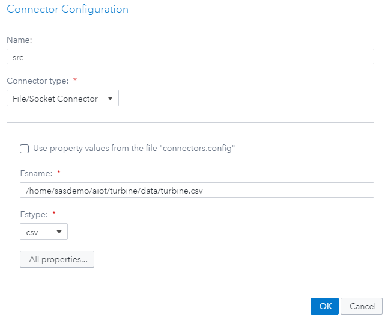
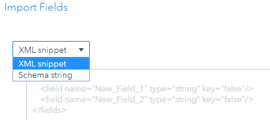
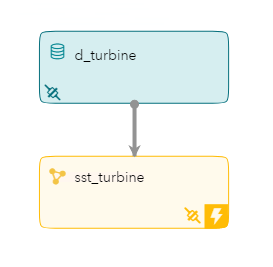
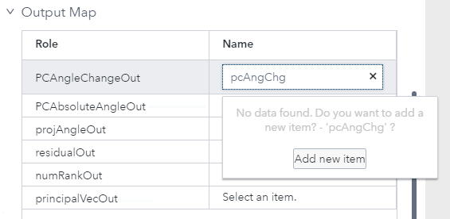
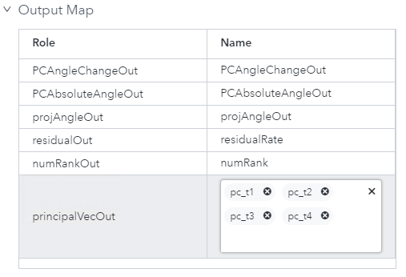
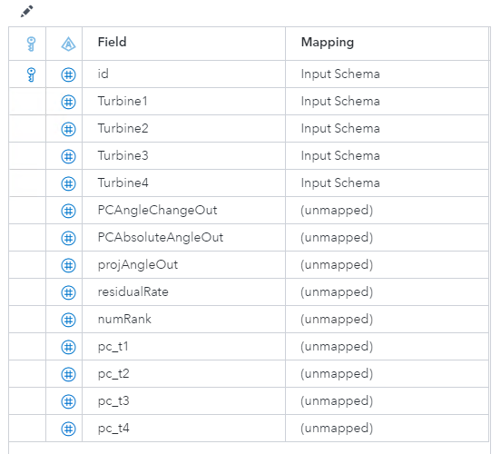
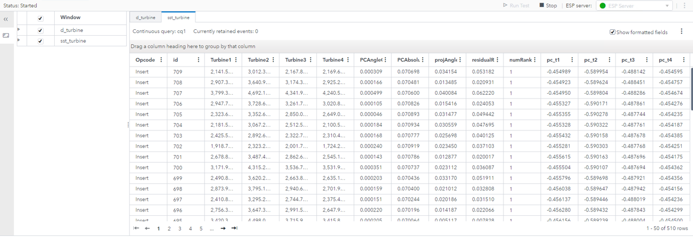
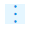
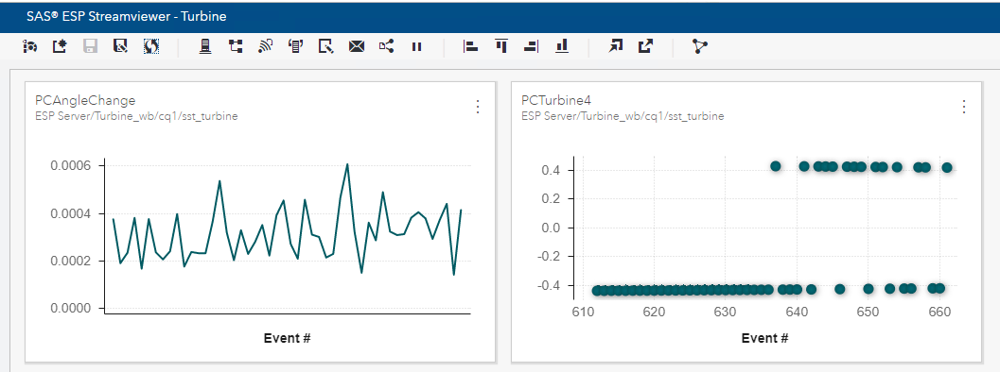

# Build and Test Streaming model in SAS ESP Studio

The following steps assume that you have access to SAS Event Stream Processing Studio and authorized to start ESP server.

## 1. Required Steps
1. Access SAS Event Stream Processing Studio by opening following URL: https://*host*/SASEventStreamProcessingStudio
The host is the system where SAS Event Stream Processing Studio is installed.
2. Start the Event Stream Processing Server. See the [link](https://go.documentation.sas.com/?cdcId=espcdc&cdcVersion=6.1&docsetId=espstudio&docsetTarget=n02795wpw65f79n1l8kls27e84l1.htm&locale=en#n0zk1grxfc2fron162rgxvg63dip) for details.
3. Open **ESP Servers** page to configure a new ESP server. 
   *  Click on ‘Add ESP Server’
   *  Add name to identify server
   *  Enter hostname
   *  Add HTTP Port
   *  Add description or tag if required.

## 2.a (Option 1) Upload Project

1.  Go to **Projects** page
    *  Click on **More actions**
    *  Select **Upload Projects** 
    *  Navigate to the location that contains the downloaded copy of [turbine_wb.xml](../project/Turbine_wb.xml) by clicking on **Upload Project files**
    *  Close and return to Project page
    *  New project named turbine_wb is created, double click to open
    *  Review properties of source and calculate windows
    *  Make following changes
        *  Change path to Input Data Connector to reflect accessible location
        
         
        *  Similarly update path of Subscriber connector to reflect accessible location
    * Save the Project
    * Follow **Sections 3-5** as described below.

## 2.b (Option 2) Create Project

1. Go to **Projects** page
   *  Create new project
   *  Add a unique name for the project
   *  Optional: add description, tag. 
   *  Click OK
2. **SAS Event Stream Processing Studio Modeler** appears
   *  Add Source window from Input Streams to workspace
   *  Add name, description 
   *  Select *‘Stateful (pi_EMPTY)’* under **State and Event Type**. Check box for ‘Accept only “Insert” events’  
   *  Expand **Input Data (Publisher) Connectors**
   *  Add new connector
   *  Add details to receive data from csv file 
      *  Copy paste or type the path to the turbine.csv file under Fsname and select Fstype as csv
       
      *  Click ‘All Properties’ and add details from the table below and click ‘OK’
      
            | Property | Value |
            | :------ | :------: |
            | rate | 10 |
            | header | 1 | 
            | noautogenfield | true | 
            | addcsvopcode | true | 
            | addcsvflags | normal | 
            | repeatcount | 20 | 

   *  Click on Output schema on the right pane and edit rows   
   *  Click on Import Schema and select XML snippet.
   
       

   *  Copy the xml below and paste it in the window. 
      ``` 
       <fields>
              <field name="id" type="int64" key="true"/>
              <field name="Turbine1" type="double"/>
              <field name="Turbine2" type="double"/>
              <field name="Turbine3" type="double"/>
              <field name="Turbine4" type="double"/>
       </fields>
      ```
   *  Add Calculate window from Analytics to workspace
   *  Connect the calculate window with source data
         
   *  Select Name and Description 
   *  Expand Settings
      *  Select ‘Online algorithm’ under Calculation
      *  Select 'SST' under Algorithm
      *  Expand Parameters and add following parameters for window based SST. Leave the default values for remaining properties.
      
            | Name | Value |
            | :------ | :------: |
            | windowLength | 200 |
            | maxPrincipal | 4 |  
            | overlap | -1 |
        *  Select Turbine1 through Turbine4 from dropdown as inputs under Input Map ( *Tip* : **SHIFT** and select Turbine1-Turbine4 to select)
        *  Type in output names for roles under Output Map. These columns will be added to the schema. 
         
        *  For principalVecOut type : pc_t1, pc_t2, pc_t3, pc_t4 for Name. Click on Add new Item when prompted. 
         
   *  Go to **Output Schema**, click on 'Edit rows'
        *  Click on Import Schema and copy fields from Input Schema
        *  Add new fields pc_t1-pc_t4 with type as 'double' 
        *  Or you can copy paste the syntax below in XML editor
            ``` 
            <fields>
              <field name="id" type="int64" key="true"/>
              <field name="Turbine1" type="double"/>
              <field name="Turbine2" type="double"/>
              <field name="Turbine3" type="double"/>
              <field name="Turbine4" type="double"/>
              <field name="PCAngleChangeOut" type="double"/>
              <field name="PCAbsoluteAngleOut" type="double"/>
              <field name="projAngleOut" type="double"/>
              <field name="residualRate" type="double"/>
              <field name="numRank" type="int32"/>
              <field name="pc_t1" type="double"/>
              <field name="pc_t2" type="double"/>
              <field name="pc_t3" type="double"/>
              <field name="pc_t4" type="double"/>
            </fields>
             ```
        
   *  Save the Project 
   *  Follow **Sections 3-5** as described below.
    
## 3. *Optional*- Add Subscriber Connector to output results

*  Expand **Subscriber Connectors**
    *  Add new connector
    *  Add details to send data to a csv file 
    *  Check box for ‘Snapshot’
    *  Copy paste or type the path to the csv file under Fsname and select Fstype as csv`
    *  Click on ‘All Properties’ and select ‘full’ for header

*  Save the Project  

## 4. Test the Project
   *  Click on **Enter Test Mode**
   *  Click on **Run Test**
   *  The image below shows the streaming data coming in and results from SST. 
     

## 5. Visualize Event Streams with Streamviwer
   * Access **SAS Event Stream Processing Streamviewer** by opening following URL: https://*Streamviewer-host-name*/SASEventStreamProcessingStreamviewer
   * If Streamviewer is not connected to an ESP server, you are prompted to enter a New ESP Server. Follow steps described in Step 3 above.
   * Create new dashboard
   * Click on Show model. This opens ESP Model Viewer. (If you don’t see any projects here then go to Enter Test Mode in ESP Studio and click on Run Test, this starts streaming data and can be viewed in ESP Streamviewer)
   * Highlight the SST-calculate window, it displays information regarding the window, fields, schema, etc. 
   * Add updating subscriber or streaming subscriber. 
   * A table is added to the dashboard. 
   * Click on   and select New Chart
   * Select Scatter plot and set values for X as Event and Y as Turbine1, click OK
   * A chart is added to the dashboard
   * Repeat the steps to add charts for Turbine2-Turbine4 or other parameters from SST model
    

Check [sample project template](../project/Turbine_wb.xml) to compare project properties.
For more details see the [link.](https://go.documentation.sas.com/?cdcId=espcdc&cdcVersion=6.1&docsetId=espvisualize&docsetTarget=titlepage.htm&locale=en)


